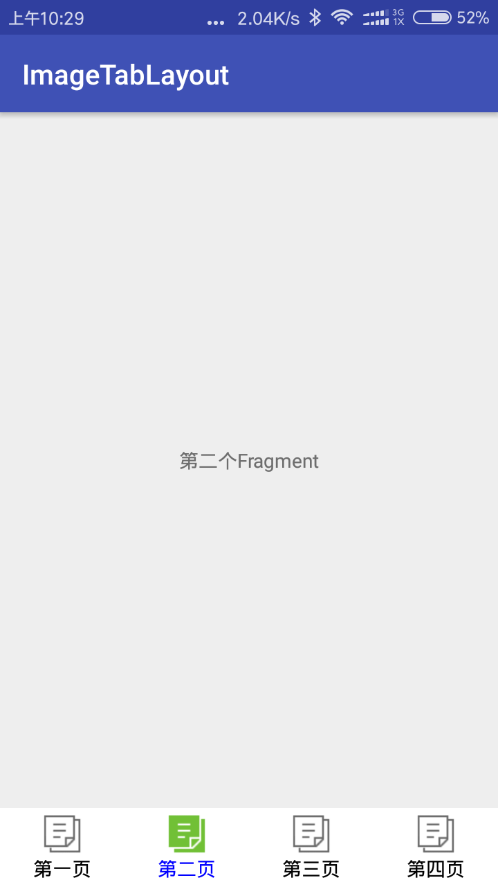

<font size=20>**# Usage**</font>

####1.**Project Gradle:**
```
    allprojects {
        repositories {
            ...
            maven { url "https://jitpack.io" }
            }
            }
```
   **App Gradle:**
```
   dependencies {
   	        compile 'com.github.Jelen0101:ImageTabLayout:v1.0.2'
   	}
```


####2.add a tab_selector.xml file in drawable:
```
    <?xml version="1.0" encoding="utf-8"?>
    <selector xmlns:android="http://schemas.android.com/apk/res/android">
        <item android:drawable="@mipmap/icon_record_pressed" android:state_selected="true" />
        <item android:drawable="@mipmap/icon_record_pressed" android:state_pressed="true" />
        <item android:drawable="@mipmap/icon_record_pressed" android:state_checked="true" />
        <item android:drawable="@mipmap/icon_record_normal" />
    </selector>
```
####3.add the layout and resource:
In Layout:
```
<?xml version="1.0" encoding="utf-8"?>
<RelativeLayout xmlns:android="http://schemas.android.com/apk/res/android"
    xmlns:tools="http://schemas.android.com/tools"
    android:id="@+id/activity_main"
    android:layout_width="match_parent"
    android:layout_height="match_parent"
    tools:context="cn.fireflights.zy.imagetablayout.sample.activity.MainActivity">
    <cn.fireflights.zy.imagetablayout.ImageTabLayout
        android:id="@+id/imageTabLayout"
        android:layout_alignParentBottom="true"
        android:background="#FFFFFF"
        android:layout_width="match_parent"
        android:layout_height="wrap_content"/>
    <android.support.v4.view.ViewPager
        android:id="@+id/viewPager"
        android:layout_width="match_parent"
        android:layout_height="match_parent"
        android:layout_above="@id/imageTabLayout"/>
</RelativeLayout>
```
In Activity:
```
//init Fragments
FirstFragment firstFragment = new FirstFragment();
SecondFragment secondFragment = new SecondFragment();
ThirdFragment thirdFragment = new ThirdFragment();
FourthFragment fourthFragment = new FourthFragment();
List<Fragment> fragments = new ArrayList<>();
fragments.add(firstFragment);
fragments.add(secondFragment);
fragments.add(thirdFragment);
fragments.add(fourthFragment);

MyViewPagerAdapter pagerAdapter = new MyViewPagerAdapter(getSupportFragmentManager(), fragments);
viewPager.setAdapter(pagerAdapter);

//image & title
List<ImageRes> imageResList = new ArrayList<>();
imageResList.add(new ImageRes("第一页", R.drawable.tab_selector));
imageResList.add(new ImageRes("第二页", R.drawable.tab_selector));
imageResList.add(new ImageRes("第三页", R.drawable.tab_selector));
imageResList.add(new ImageRes("第四页", R.drawable.tab_selector));
//after ViewPager.setAdapter()
imageTabLayout.setViewPager(viewPager, imageResList);
```
